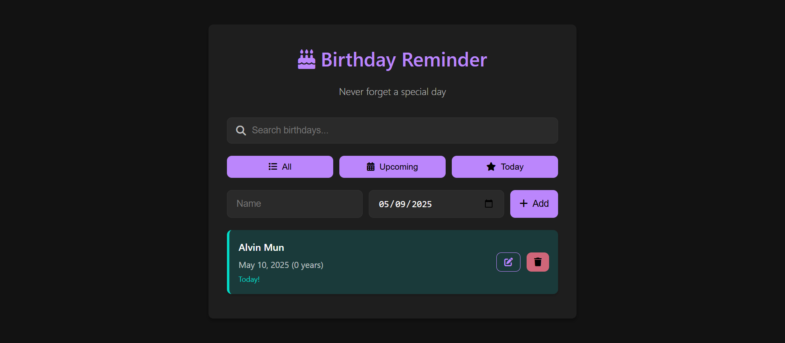

# 🎂 Birthday Reminder App

A sleek, dark-themed birthday tracking application built with vanilla HTML, CSS, and JavaScript. Made by Alvin Mun.

 

## ✨ Features

- **Add birthdays** with name and date
- **Edit or delete** existing entries
- **Search functionality** to quickly find birthdays
- **Smart filtering** (All/Upcoming/Today)
- **Age calculation** automatically displayed
- **Days remaining** countdown for upcoming birthdays
- **Today's birthdays** get special highlighting
- **Dark mode UI** with elegant purple accents
- **Local storage** - data persists between sessions
- **Mobile-responsive** design
- **Notification system** for today's birthdays

## 🛠️ Technologies Used

- **HTML5** - App structure and semantics
- **CSS3** - Styling with modern Flexbox layout
- **JavaScript (ES6)** - Core functionality
- **LocalStorage** - Client-side data persistence
- **Font Awesome** - Beautiful icons
- **Material Design principles** - UI/UX best practices

## 🚀 Installation

No installation required! This is a pure client-side web app:

1. Clone the repo:
   ```bash
   git clone https://github.com/your-username/birthday-reminder.git
